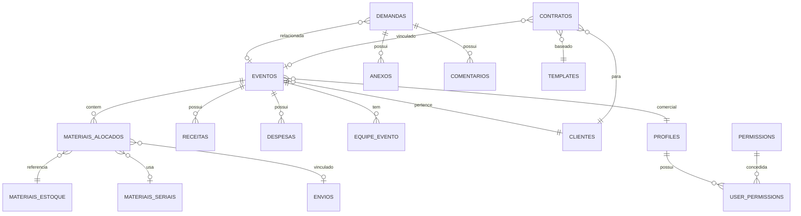
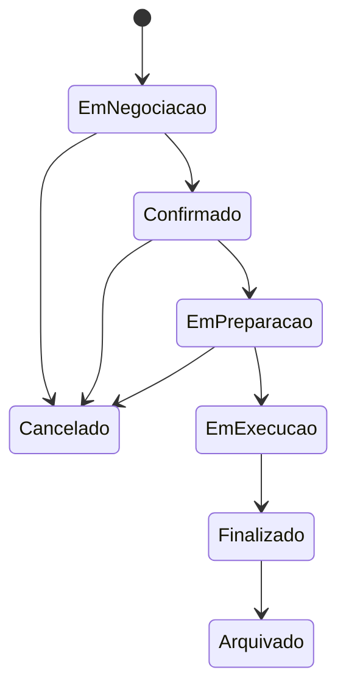
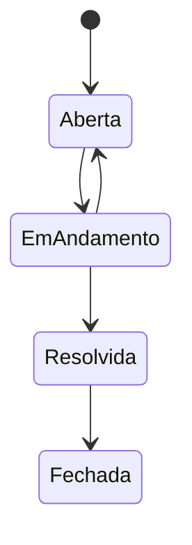
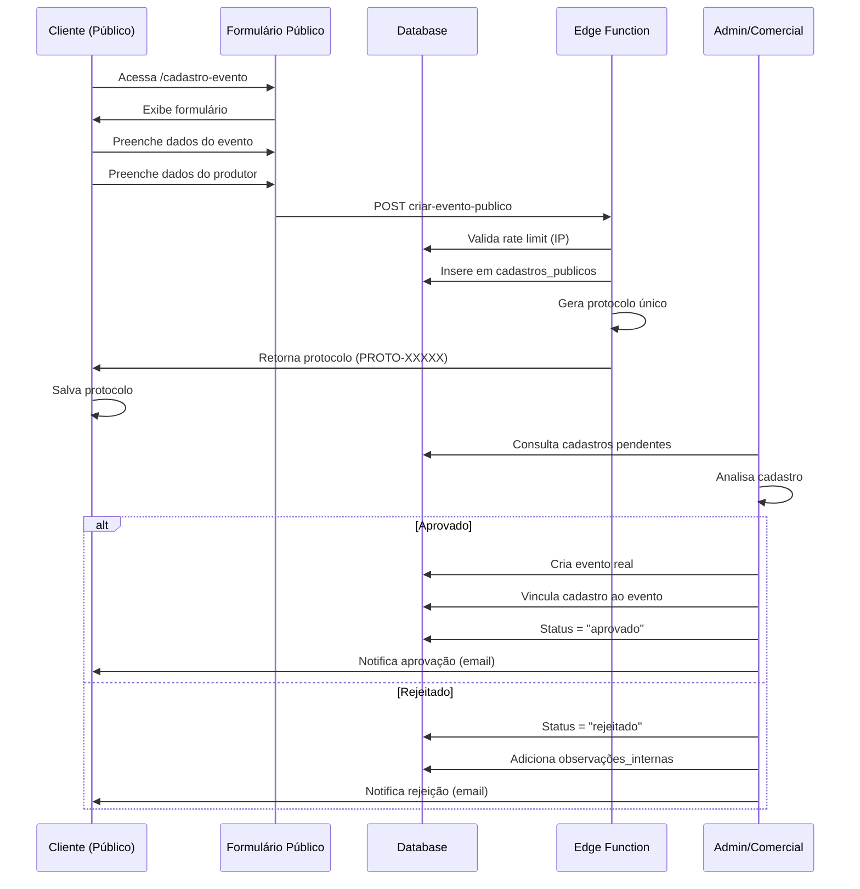
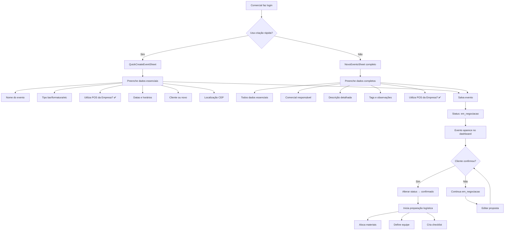
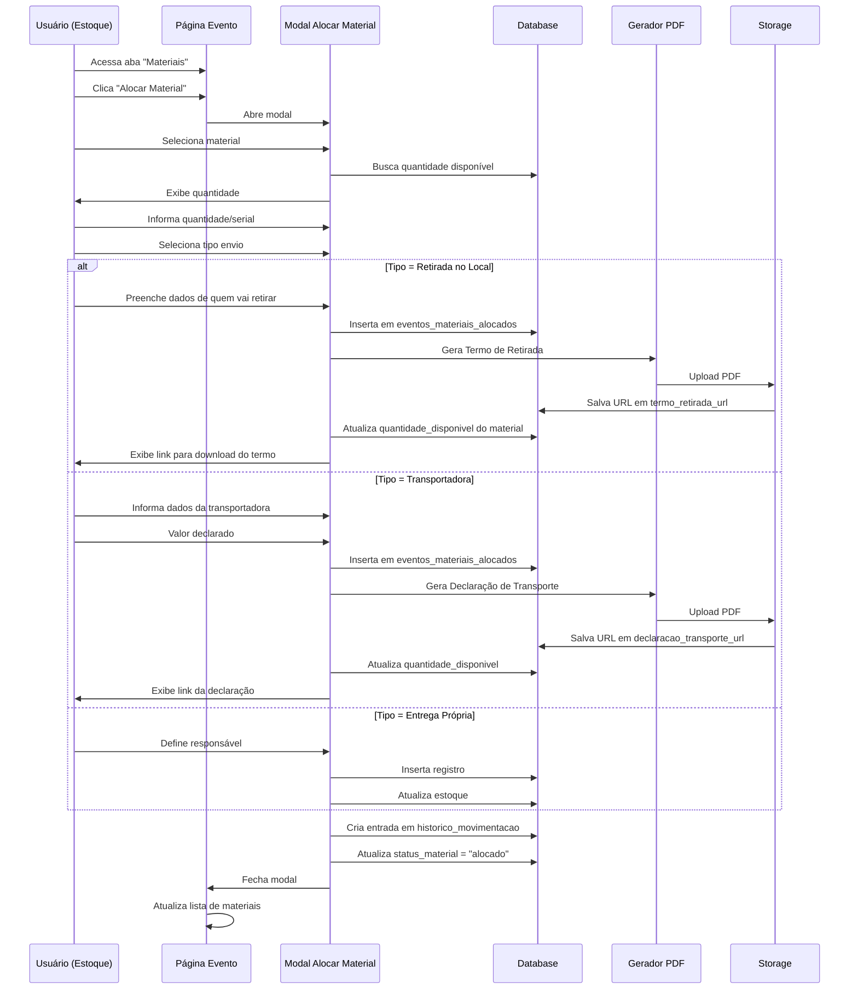
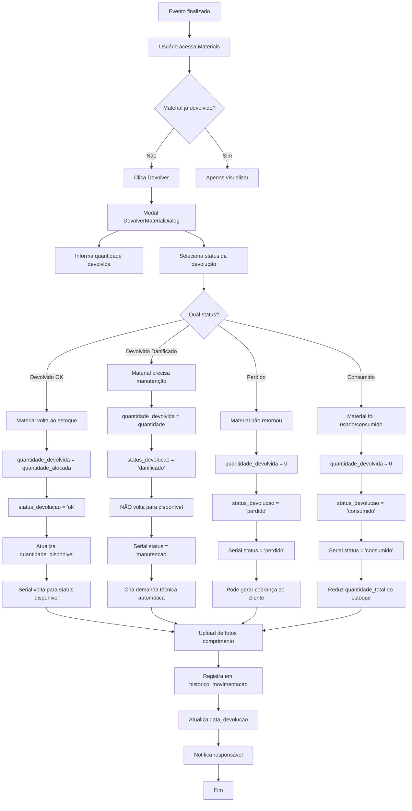
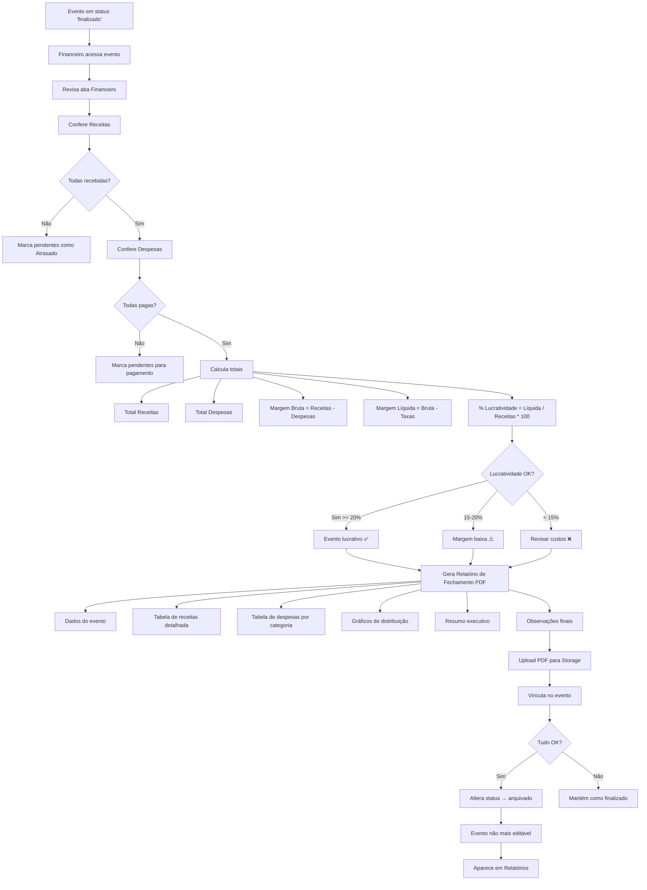
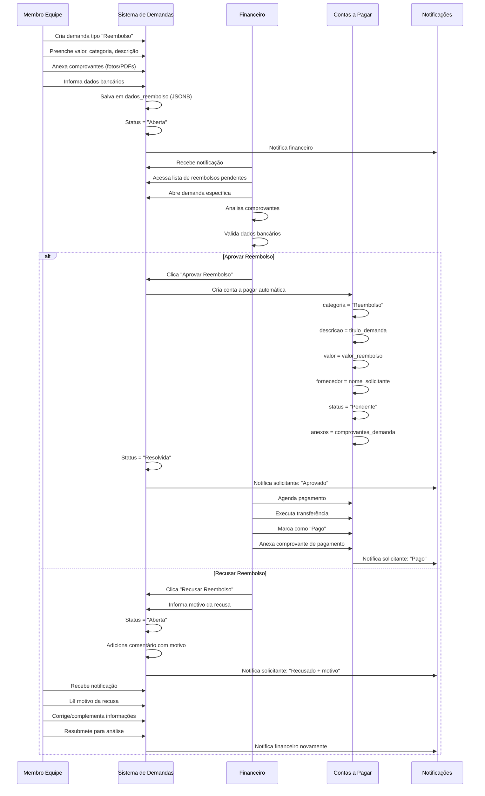

# DOCUMENTAÇÃO COMPLETA DO SISTEMA DE GESTÃO DE EVENTOS

## 📋 Índice

1. [Visão Geral do Sistema](#visão-geral-do-sistema)
2. [Arquitetura e Tecnologias](#arquitetura-e-tecnologias)
3. [Sistema de Autenticação e Permissões](#sistema-de-autenticação-e-permissões)
4. [Módulos do Sistema](#módulos-do-sistema)
5. [Fluxos de Processos Completos](#fluxos-de-processos-completos)
6. [Integrações e APIs](#integrações-e-apis)
7. [Segurança e Compliance](#segurança-e-compliance)
8. [Glossário de Termos](#glossário-de-termos)

---

## Visão Geral do Sistema

### Propósito
Sistema completo de gestão de eventos corporativos que abrange desde o cadastro público até o fechamento financeiro, incluindo controle de estoque, logística, equipe operacional e demandas internas.

### Objetivos Principais
- **Centralização**: Unificar todas as operações relacionadas a eventos em uma única plataforma
- **Rastreabilidade**: Garantir histórico completo de todas as operações e movimentações
- **Compliance**: Documentação legal automática (termos de retirada, declarações de transporte)
- **Eficiência Operacional**: Reduzir tempo de execução e minimizar erros através de automação
- **Visibilidade Financeira**: Controle detalhado de receitas, despesas e taxas por evento

### Perfis de Usuário

#### 👑 Administrador
- Acesso total ao sistema
- Gerenciamento de usuários e permissões
- Configurações globais
- Visualização de todos os eventos e dados financeiros

#### 💼 Comercial
- Criação e edição de eventos próprios
- Gestão de clientes
- Criação de propostas e contratos
- Visualização de eventos de todos os comerciais
- Acesso limitado a dados financeiros (apenas visualização de receitas)

#### 🛠️ Suporte/Operacional
- Gestão de estoque e materiais
- Alocação e devolução de equipamentos
- Gestão de equipe operacional
- Logística e transportadoras
- Demandas operacionais

#### 💰 Financeiro
- Gestão de contas a pagar e receber
- Aprovação de reembolsos
- Fechamento financeiro de eventos
- Relatórios financeiros

---

## Arquitetura e Tecnologias

### Frontend
```
React 18 + TypeScript + Vite
├── UI Framework: Tailwind CSS + shadcn/ui
├── State Management: TanStack Query (React Query)
├── Routing: React Router DOM v6
├── Forms: React Hook Form + Zod
├── Virtualização: TanStack Virtual
└── PWA: Service Workers + Web Manifest
```

### Backend (Lovable Cloud / Supabase)
```
PostgreSQL 15
├── Auth: Supabase Auth (JWT)
├── Storage: Supabase Storage (PDFs, imagens)
├── Realtime: PostgreSQL LISTEN/NOTIFY
├── Edge Functions: Deno Runtime
└── RLS: Row Level Security em todas as tabelas
```

### Arquitetura de Dados



### Estrutura de Pastas

```
src/
├── components/           # Componentes React
│   ├── clientes/        # Gestão de clientes
│   ├── contratos/       # Contratos e templates
│   ├── demandas/        # Sistema de demandas
│   ├── equipe/          # Equipe operacional
│   ├── estoque/         # Controle de estoque
│   ├── eventos/         # Gestão de eventos
│   ├── financeiro/      # Financeiro
│   ├── layout/          # Layout e navegação
│   ├── shared/          # Componentes compartilhados
│   ├── transportadoras/ # Logística
│   └── ui/              # Componentes UI base (shadcn)
├── contexts/            # React Query hooks customizados
├── hooks/               # Custom hooks
├── lib/                 # Utilitários e validações
├── pages/               # Páginas da aplicação
├── types/               # TypeScript types
└── utils/               # Funções utilitárias
```

---

## Sistema de Autenticação e Permissões

### Autenticação
- **Método**: Email/Password via Supabase Auth
- **Token**: JWT armazenado em localStorage
- **Auto-confirm**: Emails confirmados automaticamente (desenvolvimento)
- **Rate Limiting**: Proteção contra força bruta (5 tentativas/15min)

### Sistema de Permissões Granulares

O sistema possui **mais de 50 permissões individuais** que podem ser combinadas livremente:

#### Eventos (12 permissões)
```typescript
eventos.visualizar              // Ver lista de eventos
eventos.visualizar_proprios     // Ver apenas seus eventos
eventos.criar                   // Criar novos eventos
eventos.editar_todos            // Editar qualquer evento
eventos.editar_proprios         // Editar apenas seus eventos
eventos.excluir                 // Deletar eventos
eventos.alterar_status          // Mudar status do evento
eventos.gerenciar_equipe        // Adicionar/remover equipe
eventos.gerenciar_materiais     // Alocar/devolver materiais
eventos.visualizar_operacao     // Ver aba de operação
eventos.editar_operacao         // Editar dados operacionais
eventos.arquivar                // Arquivar eventos
```

#### Clientes (5 permissões)
```typescript
clientes.visualizar        // Ver lista de clientes
clientes.criar             // Cadastrar novos clientes
clientes.editar            // Editar dados de clientes
clientes.excluir           // Deletar clientes
clientes.exportar          // Exportar dados
```

#### Financeiro (9 permissões)
```typescript
financeiro.visualizar                    // Ver dados financeiros
financeiro.receitas.visualizar           // Ver receitas
financeiro.receitas.criar                // Criar receitas
financeiro.receitas.editar               // Editar receitas
financeiro.despesas.visualizar           // Ver despesas
financeiro.despesas.criar                // Criar despesas
financeiro.despesas.editar               // Editar despesas
financeiro.aprovar_reembolsos            // Aprovar reembolsos
financeiro.visualizar_contas_gerais      // Ver contas a pagar/receber
```

#### Estoque (8 permissões)
```typescript
estoque.visualizar              // Ver materiais
estoque.criar                   // Cadastrar materiais
estoque.editar                  // Editar materiais
estoque.excluir                 // Deletar materiais
estoque.gerenciar_quantidade    // Ajustar quantidades
estoque.gerenciar_seriais       // Gerenciar números de série
estoque.alocar                  // Alocar para eventos
estoque.visualizar_historico    // Ver histórico de movimentações
```

#### Equipe (6 permissões)
```typescript
equipe.visualizar                  // Ver membros
equipe.operacional.visualizar      // Ver equipe operacional
equipe.operacional.criar           // Cadastrar operacionais
equipe.operacional.editar          // Editar operacionais
equipe.operacional.excluir         // Deletar operacionais
equipe.gerenciar_alocacoes         // Alocar em eventos
```

#### Operações (3 permissões)
```typescript
operacoes.gerenciar_checklist      // Checklist de materiais
operacoes.registrar_ocorrencias    // Registrar problemas
operacoes.visualizar_timeline      // Ver histórico
```

#### Demandas (6 permissões)
```typescript
demandas.visualizar           // Ver demandas
demandas.criar                // Criar demandas
demandas.editar               // Editar demandas
demandas.resolver             // Marcar como resolvida
demandas.aprovar_reembolso    // Aprovar reembolsos
demandas.recusar_reembolso    // Recusar reembolsos
```

#### Contratos (5 permissões)
```typescript
contratos.visualizar      // Ver contratos
contratos.criar           // Criar contratos
contratos.editar          // Editar contratos
contratos.assinar         // Assinar digitalmente
contratos.excluir         // Deletar contratos
```

#### Transportadoras (5 permissões)
```typescript
transportadoras.visualizar    // Ver transportadoras
transportadoras.criar         // Cadastrar transportadoras
transportadoras.editar        // Editar transportadoras
transportadoras.excluir       // Deletar transportadoras
transportadoras.criar_envios  // Criar envios
```

#### Cadastros Públicos (3 permissões)
```typescript
cadastros.visualizar     // Ver cadastros públicos
cadastros.aprovar        // Aprovar cadastro
cadastros.rejeitar       // Rejeitar cadastro
```

#### Usuários (4 permissões)
```typescript
usuarios.visualizar              // Ver usuários
usuarios.criar                   // Criar usuários
usuarios.editar_permissoes       // Gerenciar permissões
usuarios.excluir                 // Deletar usuários
```

### Templates de Permissões

#### 🔴 Admin (Acesso Total)
- Todas as 50+ permissões
- Acesso irrestrito a todos os módulos
- Configurações do sistema

#### 🟢 Comercial
```
✅ Eventos: criar, editar_proprios, visualizar
✅ Clientes: todas
✅ Contratos: todas
✅ Financeiro: apenas receitas (visualizar)
✅ Demandas: criar, visualizar, editar
❌ Estoque: sem acesso
❌ Equipe Operacional: sem acesso
❌ Financeiro: contas gerais, despesas
```

#### 🟡 Suporte/Operacional
```
✅ Eventos: visualizar, gerenciar_materiais, gerenciar_equipe
✅ Estoque: todas
✅ Equipe: todas
✅ Transportadoras: todas
✅ Operações: todas
✅ Demandas: criar, visualizar, resolver
❌ Financeiro: sem acesso
❌ Clientes: apenas visualizar
```

#### 🔵 Financeiro
```
✅ Financeiro: todas
✅ Eventos: visualizar
✅ Demandas: aprovar/recusar reembolsos
✅ Clientes: visualizar
❌ Estoque: sem acesso
❌ Equipe: sem acesso
```

---

## Módulos do Sistema

### 📊 Dashboard

**Objetivo**: Visão executiva consolidada do negócio

#### KPIs Principais (Admin)
- Total de eventos ativos
- Receita total do mês
- Despesas do mês
- Margem de lucro
- Taxa de ocupação de estoque
- Demandas abertas
- Próximos eventos (7 dias)

#### KPIs Comercial
- Meus eventos ativos
- Eventos em negociação
- Taxa de conversão
- Valor total em negociação
- Próximos eventos

#### KPIs Suporte
- Materiais alocados
- Devoluções pendentes
- Demandas operacionais abertas
- Eventos em execução

---

### 🎉 Gestão de Eventos

**Objetivo**: Gerenciar todo o ciclo de vida do evento

#### Status de Evento


**Estados Detalhados**:

1. **Em Negociação** (`em_negociacao`)
   - Evento em fase de proposta
   - Cliente ainda não confirmou
   - Possível edição de todos os dados
   - Badge: 🟡 Amarelo

2. **Confirmado** (`confirmado`)
   - Cliente confirmou o evento
   - Inicia preparação logística
   - Requer motivo para alterações de data/local
   - Badge: 🟢 Verde

3. **Em Preparação** (`em_preparacao`)
   - Separação de materiais iniciada
   - Alocação de equipe em andamento
   - Checklist operacional ativo
   - Badge: 🔵 Azul

4. **Em Execução** (`em_execucao`)
   - Evento acontecendo
   - Registro de ocorrências em tempo real
   - Materiais em uso
   - Badge: 🟣 Roxo

5. **Finalizado** (`finalizado`)
   - Evento concluído
   - Aguardando devolução de materiais
   - Fechamento financeiro pendente
   - Badge: 🟤 Marrom

6. **Arquivado** (`arquivado`)
   - Fechamento completo
   - Todos materiais devolvidos
   - Financeiro fechado
   - Somente leitura
   - Badge: ⚫ Cinza

7. **Cancelado** (`cancelado`)
   - Evento cancelado
   - Materiais devolvidos (se alocados)
   - Badge: 🔴 Vermelho

#### Abas do Evento

##### 1️⃣ Dados
- Informações básicas (nome, tipo, datas)
- Cliente vinculado
- Comercial responsável
- Localização completa
- **Badge "POS Empresa"** (se `utiliza_pos_empresa = true`)
- Configurações de bar/ingresso
- Tags e observações

##### 2️⃣ Materiais
- Lista de materiais alocados
- Status: Alocado, Em Trânsito, Retirado, Devolvido
- Geração automática de:
  - 📄 Termo de Retirada
  - 📋 Declaração de Transporte
- Vinculação com envios de transportadora
- Registro de devolução com fotos
- Histórico de movimentações

##### 3️⃣ Operação
- Equipe alocada (função, contato, período)
- Checklist de materiais pendentes
- Observações operacionais
- Timeline de eventos

##### 4️⃣ Demandas
- Demandas vinculadas ao evento
- Criação rápida de demanda
- Status e responsáveis
- Prioridade e prazos

##### 5️⃣ Financeiro
- **Receitas**:
  - Serviços contratados
  - Formas de pagamento
  - Status (Pendente, Recebido, Atrasado)
  - Taxas de cartão automáticas
- **Despesas**:
  - Categorias (logística, mão de obra, materiais, etc.)
  - Comprovantes anexados
  - Status (Pendente, Pago)
- **Resumo**:
  - Total de receitas
  - Total de despesas
  - Margem bruta/líquida
  - Taxa de lucratividade

##### 6️⃣ Contratos
- Contratos vinculados
- Histórico de assinaturas
- Download de PDFs
- Status de aprovações

---

### 👥 Gestão de Clientes

**Objetivo**: Cadastro completo de clientes (PF/PJ)

#### Dados Cadastrados
- **Tipo**: Pessoa Física ou Jurídica
- **Nome/Razão Social**
- **CPF/CNPJ** (validação automática)
- **Email** (validação de formato)
- **Telefone** e WhatsApp
- **Endereço Completo**:
  - CEP (busca automática via ViaCEP)
  - Logradouro, número, complemento
  - Bairro, cidade, estado
- **Responsável Legal** (para PJ):
  - Nome, CPF, telefone
  - Email e cargo

#### Funcionalidades
- Busca por CEP (integração ViaCEP)
- Validação de CPF/CNPJ
- Máscara automática em campos
- Histórico de eventos do cliente
- Exportação de dados

---

### 📝 Sistema de Demandas

**Objetivo**: Gerenciar solicitações internas e reembolsos

#### Tipos de Demanda
1. **Técnica** - Problemas com equipamentos
2. **Operacional** - Questões de logística/execução
3. **Comercial** - Negociação, propostas
4. **Financeira** - Cobranças, pagamentos
5. **Administrativa** - Processos internos
6. **Reembolso** - Solicitações de reembolso

#### Workflow


#### Campos Principais
- **Título** e **Descrição**
- **Categoria** e **Prioridade** (Baixa, Média, Alta, Urgente)
- **Solicitante** (quem abriu)
- **Responsável** (quem vai resolver)
- **Evento Vinculado** (opcional)
- **Prazo** (data limite)
- **Status** e **Resolvida** (boolean)
- **Tags** (array de strings)

#### Sistema de Reembolso
Quando tipo = "Reembolso":
- **Dados adicionais** em `dados_reembolso` (JSONB):
  ```json
  {
    "valor": 150.00,
    "categoria": "Transporte",
    "data_despesa": "2024-01-15",
    "descricao_completa": "Uber para evento",
    "forma_pagamento": "PIX",
    "dados_bancarios": {
      "banco": "Nubank",
      "agencia": "0001",
      "conta": "12345-6",
      "tipo_conta": "Corrente",
      "titular": "João Silva",
      "cpf": "123.456.789-00"
    }
  }
  ```
- **Workflow de Aprovação**:
  1. Usuário cria demanda de reembolso
  2. Anexa comprovantes (fotos, notas fiscais)
  3. Financeiro analisa
  4. **Aprovar**: Gera conta a pagar automática
  5. **Recusar**: Demanda volta para solicitante com justificativa

#### Anexos e Comentários
- Upload de múltiplos arquivos
- Comentários com histórico
- Tipos: "comentario", "status_change", "anexo_adicionado"
- Notificações em tempo real

---

### 📦 Controle de Estoque

**Objetivo**: Gestão completa de materiais e equipamentos

#### Categorias de Materiais
- Áudio (caixas, microfones, mesa de som)
- Iluminação (moving heads, par LED, refletores)
- Estrutura (box truss, treliças, bases)
- Bar (chopeiras, geladeiras, balcões)
- Mobiliário (mesas, cadeiras, sofás)
- Decoração (tapetes, plantas, painéis)
- Tecnologia (tablets, impressoras, roteadores)
- Consumíveis (copos, pratos, talheres)

#### Dados do Material
```typescript
{
  id: string                      // UUID
  nome: string                    // "Caixa de Som JBL PRX615"
  categoria: string               // "Audio"
  descricao: string | null        // Descrição detalhada
  foto: string | null             // URL da foto
  tipo_controle: string           // "quantidade" | "serial"
  quantidade_total: number        // Estoque total
  quantidade_disponivel: number   // Disponível para alocação
  quantidade_minima: number       // Alerta de estoque baixo
  valor_unitario: number | null   // Valor para cobrança
}
```

#### Controle de Quantidade vs Serial

**Quantidade** (para itens fungíveis):
- Exemplo: 500 copos descartáveis
- Apenas quantidade total/disponível
- Não rastreia unidades individuais

**Serial** (para equipamentos rastreáveis):
- Exemplo: 10 Moving Heads
- Cada unidade tem número de série único
- Rastreamento completo por serial

#### Números de Série
```typescript
{
  id: string
  material_id: string             // Referência ao material
  serial_numero: string           // "MH001", "TRELIÇA-TR15"
  status: SerialStatus            // Status atual
  localizacao_atual: string       // Onde está
  evento_alocado_id: string | null // Se alocado
  observacoes: string | null      // Histórico
  data_aquisicao: date            // Quando foi adquirido
  valor_aquisicao: number | null  // Custo de aquisição
}

enum SerialStatus {
  disponivel       // Disponível no estoque
  em-uso           // Alocado para evento
  manutencao       // Em manutenção
  perdido          // Extraviado
  consumido        // Consumido/descartado
}
```

#### Histórico de Movimentações
Toda movimentação é registrada em `materiais_historico_movimentacao`:
- **Tipo de Operação**: alocacao, devolucao, ajuste, manutencao, perda
- **Quantidade/Serial**
- **Evento vinculado** (se aplicável)
- **Responsável** (usuário que executou)
- **Localização origem/destino**
- **Data e hora**
- **Observações**
- **Fotos comprovantes** (principalmente para devoluções)

---

### 💰 Gestão Financeira

#### Contas a Receber

**Objetivo**: Controlar valores a receber de clientes

```typescript
{
  id: string
  descricao: string                // "Mensalidade Janeiro 2024"
  cliente: string                  // Nome do cliente
  tipo: string                     // "Servico", "Produto", "Aluguel", etc.
  valor_unitario: number           // Valor de cada unidade
  quantidade: number               // Quantidade
  valor: number                    // Total (unitario * quantidade)
  data_vencimento: date            // Quando vence
  data_recebimento: date | null    // Quando foi pago
  status: FinanceiroStatus         // "Pendente", "Recebido", "Atrasado"
  forma_recebimento: string | null // "PIX", "Cartão", "Boleto", etc.
  recorrencia: string              // "unica", "mensal", "trimestral", etc.
  proxima_data_geracao: date | null // Para recorrentes
  recorrencia_origem_id: string | null // ID da conta original (se recorrente)
  observacoes: string | null
  anexos: JSON | null              // Array de URLs
  responsavel: string | null       // Quem é responsável pela cobrança
}
```

**Funcionalidades**:
- Criação única ou recorrente
- Geração automática de parcelas futuras
- Upload de comprovantes
- Filtros por status, período, cliente
- Marcar como recebido em lote
- Relatórios de recebimento

#### Contas a Pagar

**Objetivo**: Controlar despesas e fornecedores

```typescript
{
  id: string
  descricao: string                // "Aluguel Galpão - Janeiro"
  fornecedor: string | null        // Nome do fornecedor
  categoria: string                // "Aluguel", "Salario", "Fornecedor", etc.
  valor_unitario: number
  quantidade: number
  valor: number
  data_vencimento: date
  data_pagamento: date | null
  status: FinanceiroStatus
  forma_pagamento: string | null   // "PIX", "Boleto", "Transferência"
  recorrencia: string
  proxima_data_geracao: date | null
  recorrencia_origem_id: string | null
  observacoes: string | null
  anexos: JSON | null
  responsavel: string | null       // Quem aprovou o pagamento
}
```

**Categorias Padrão**:
- Aluguel
- Salários
- Fornecedores
- Impostos
- Manutenção
- Marketing
- Transporte
- Outros

#### Sistema de Reembolso de Equipe

**Fluxo Completo**:

1. **Membro da Equipe**:
   - Cria demanda tipo "Reembolso"
   - Preenche valor, categoria, descrição
   - Anexa comprovantes (fotos, notas)
   - Informa dados bancários

2. **Financeiro**:
   - Visualiza lista de reembolsos pendentes
   - Analisa comprovantes
   - **Aprovar**:
     - Sistema cria conta a pagar automaticamente
     - Categoria: "Reembolso"
     - Valor e dados já preenchidos
     - Status: "Pendente"
   - **Recusar**:
     - Informa motivo da recusa
     - Demanda volta para solicitante
     - Solicitante pode corrigir e reenviar

3. **Pagamento**:
   - Conta a pagar aprovada entra na fila
   - Financeiro marca como paga
   - Anexa comprovante de transferência
   - Sistema notifica solicitante

**Dados Bancários**:
```json
{
  "banco": "Banco do Brasil",
  "agencia": "1234-5",
  "conta": "67890-1",
  "tipo_conta": "Corrente",
  "pix": "email@example.com",
  "titular": "Nome Completo",
  "cpf": "123.456.789-00"
}
```

---

### 📄 Contratos e Propostas

**Objetivo**: Criar, gerenciar e assinar contratos digitalmente

#### Templates de Contrato
- Nome e descrição
- Tipo (Prestação de Serviços, Locação, etc.)
- Conteúdo em Rich Text (HTML)
- Variáveis dinâmicas: `{{nome_cliente}}`, `{{valor_total}}`, etc.
- Margens personalizadas
- Papel timbrado (logo da empresa)

#### Contrato
```typescript
{
  id: string
  numero: string                   // "CONT-2024-001"
  titulo: string                   // "Contrato de Locação - Evento X"
  tipo: string                     // "prestacao_servicos", "locacao"
  template_id: string | null       // Template base usado
  cliente_id: string | null
  evento_id: string | null
  conteudo: string                 // HTML do contrato
  itens: JSON | null               // Lista de itens/serviços
  valor: number | null             // Valor total
  data_inicio: date | null
  data_fim: date | null
  status: StatusContrato           // "rascunho", "enviado", "assinado", "cancelado"
  assinaturas: JSON                // Array de assinaturas digitais
  aprovacoes_historico: JSON | null // Histórico de aprovações
  condicoes_pagamento: string | null
  prazo_execucao: string | null
  garantia: string | null
  validade: string | null
  observacoes: string | null
  observacoes_comerciais: string | null
  anexos: string[] | null          // PDFs anexados
}
```

#### Geração de PDF
- Renderiza HTML com dados do cliente/evento
- Substitui variáveis automaticamente
- Inclui papel timbrado
- Assinaturas digitais visíveis
- Download direto

#### Proposta → Contrato
- Proposta é um contrato em status "rascunho"
- Quando aprovado, muda para "enviado"
- Cliente assina digitalmente
- Status muda para "assinado"
- Vincula automaticamente ao evento

---

### 🚚 Transportadoras e Logística

**Objetivo**: Gerenciar envio de materiais via transportadoras

#### Transportadora
```typescript
{
  id: string
  nome: string                     // "Transportadora XYZ Ltda"
  cnpj: string
  contato_principal: JSON          // { nome, telefone, email }
  endereco: JSON                   // Endereço completo
  rotas_disponiveis: string[]      // ["SP-RJ", "SP-MG"]
  prazo_padrao_dias: number        // 5 dias
  valor_km: number | null          // R$ 2,50/km
  observacoes: string | null
  ativo: boolean
}
```

#### Envio
```typescript
{
  id: string
  transportadora_id: string | null
  evento_id: string | null
  tipo: TipoEnvio                  // "ida", "volta", "ida_volta"
  origem: string                   // "Galpão SP - Rua X, 123"
  destino: string                  // "Local do Evento - Av Y, 456"
  data_entrega_prevista: date
  data_coleta: date | null
  data_entrega: date | null
  status: string                   // "pendente", "coletado", "em_transito", "entregue"
  rastreio: string | null          // Código de rastreamento
  valor: number | null
  forma_pagamento: string          // "pix", "boleto", "cartao"
  comprovante_pagamento: string | null // URL do comprovante
  observacoes: string | null
  despesa_evento_id: string | null // Vincula com despesa do evento
}
```

#### Materiais no Envio
- Em `eventos_materiais_alocados`, campo `envio_id`
- Múltiplos materiais podem estar no mesmo envio
- Geração de **Declaração de Transporte** automática
- Inclui:
  - Lista de materiais
  - Valor declarado total
  - Dados da transportadora
  - Remetente e destinatário
  - Assinatura digital

---

## Fluxos de Processos Completos

### 🌐 1. Cadastro Público de Evento

**Objetivo**: Cliente preenche formulário público e aguarda aprovação



**Campos do Formulário Público**:
- **Dados do Evento**:
  - Nome do evento
  - Tipo (bar, formatura, casamento, etc.)
  - Data início/fim, hora início/fim
  - Local, endereço, cidade, estado
  - Configurações de bar/ingresso (JSONB)
- **Dados do Produtor**:
  - Nome completo
  - CPF/CNPJ
  - Email
  - Telefone/WhatsApp
  - Cargo/função

**Validações**:
- Rate limiting por IP (max 3 cadastros/hora)
- CPF/CNPJ válidos
- Email válido
- Datas futuras

**Acompanhamento**:
- Cliente acessa `/acompanhar-cadastro`
- Informa protocolo
- Visualiza status: Pendente → Aprovado/Rejeitado
- Se aprovado, visualiza dados básicos do evento criado

---

### 💼 2. Criação de Evento pelo Comercial

**Objetivo**: Comercial cria evento completo após negociação



**Campos da Criação Rápida**:
1. **Nome do evento**
2. **Tipo de evento** (botões visuais)
3. **✅ Utiliza POS da Empresa** (checkbox)
4. **Data início/fim**
5. **Cliente** (select ou "Criar novo")
6. **Comercial responsável**
7. **Localização**:
   - CEP (busca automática)
   - Endereço completo auto-preenchido
8. **Tags** (opcional)
9. **Descrição** (opcional)

**Auto-save**:
- Salva em `localStorage` a cada mudança
- Recupera dados ao reabrir o modal
- Botão "Limpar rascunho"

**Criação do Cliente Inline**:
- Se não encontra cliente, pode criar na hora
- Modal de criação simplificado
- Retorna e vincula automaticamente

---

### 📦 3. Alocação de Material para Evento

**Objetivo**: Separar e documentar materiais para o evento



**Dados da Alocação**:
```typescript
{
  material_id: string              // ID do material
  quantidade_alocada: number       // Quantidade
  serial: string | null            // Se controle por serial
  tipo_envio: TipoEnvio           // "retirada_local" | "transportadora" | "entrega_propria"
  
  // Se retirada_local:
  retirado_por_nome: string
  retirado_por_documento: string   // CPF
  retirado_por_telefone: string
  termo_retirada_url: string       // PDF gerado
  
  // Se transportadora:
  transportadora: string
  rastreamento: string | null
  valor_declarado: number
  declaracao_transporte_url: string // PDF gerado
  dados_transportadora: JSON
  dados_destinatario: JSON
  remetente_dados: JSON
  
  // Se entrega_propria:
  responsavel: string              // Nome do funcionário
  remetente_tipo: "funcionario" | "operacional"
  remetente_membro_id: string | null
}
```

**Documentos Gerados Automaticamente**:

**Termo de Retirada**:
- Logo da empresa
- Dados do evento
- Lista de materiais (nome, quantidade, serial)
- Dados de quem está retirando
- Data e hora
- Campo para assinatura
- Observações de transporte

**Declaração de Transporte**:
- Logo da empresa
- Dados do remetente (empresa)
- Dados do destinatário (cliente/local do evento)
- Dados da transportadora
- Lista de materiais com valor declarado
- Valor total declarado
- Observações de transporte
- Termo de responsabilidade

---

### 🔄 4. Devolução de Material

**Objetivo**: Registrar retorno de materiais após o evento



**Validações**:
- Não pode devolver mais que alocado
- Fotos obrigatórias para status "danificado" ou "perdido"
- Observações obrigatórias para "danificado"

**Ações Automáticas**:
- **OK**: Material volta 100% disponível
- **Danificado**: Cria demanda técnica, responsável = equipe de manutenção
- **Perdido**: Pode criar cobrança extra no evento
- **Consumido**: Reduz estoque permanentemente

---

### 💵 5. Fechamento Financeiro de Evento

**Objetivo**: Consolidar receitas e despesas, gerar relatório



**Relatório de Fechamento Inclui**:
- Resumo do evento (nome, data, cliente, local)
- Totais de receitas (por tipo e forma de pagamento)
- Totais de despesas (por categoria)
- Taxas de cartão calculadas
- Margem bruta e líquida
- Gráficos de pizza (distribuição de receitas e despesas)
- Observações e notas finais
- Data de geração e responsável

---

### 💳 6. Fluxo de Reembolso Completo

**Objetivo**: Membro solicita, financeiro aprova, sistema gera pagamento



**Dados Bancários Salvos**:
```json
{
  "banco": "341 - Itaú Unibanco",
  "agencia": "1234",
  "conta": "56789-0",
  "tipo_conta": "Corrente",
  "pix": "email@example.com",
  "titular": "João Silva",
  "cpf": "123.456.789-00"
}
```

**Categorias de Reembolso**:
- Transporte (Uber, combustível)
- Alimentação (refeições durante evento)
- Materiais (compras emergenciais)
- Hospedagem (hotéis)
- Outros (diversos)

---

## Integrações e APIs

### 🌐 ViaCEP
**Objetivo**: Busca automática de endereço por CEP

**Endpoint**: `https://viacep.com.br/ws/{cep}/json/`

**Uso**:
```typescript
// src/lib/api/viacep.ts
export async function buscarEnderecoPorCEP(cep: string) {
  const cepLimpo = cep.replace(/\D/g, '');
  const response = await fetch(`https://viacep.com.br/ws/${cepLimpo}/json/`);
  return response.json();
}
```

**Componentes que usam**:
- NovoClienteSheet
- EditarClienteSheet
- NovoEventoSheet
- QuickCreateEventSheet
- NovaTransportadoraSheet

---

### 📄 Geração de PDFs

**Biblioteca**: jsPDF + jspdf-autotable

**Tipos de Documentos Gerados**:

#### 1. Termo de Retirada
- Gerado em: `src/utils/termoRetiradaPDF.ts`
- Quando: Ao alocar material com tipo "Retirada no Local"
- Conteúdo:
  - Cabeçalho com logo
  - Dados do evento
  - Tabela de materiais
  - Dados de quem retira
  - Termo de responsabilidade
  - Campo para assinatura

#### 2. Declaração de Transporte
- Gerado em: `src/utils/declaracaoTransportePDF.ts`
- Quando: Ao alocar material com tipo "Transportadora"
- Conteúdo:
  - Cabeçalho com logo
  - Dados do remetente (empresa)
  - Dados do destinatário (cliente)
  - Dados da transportadora
  - Tabela de materiais com valores
  - Valor total declarado
  - Termo de responsabilidade

#### 3. Relatório de Fechamento
- Gerado em: Componente RelatorioFechamentoDialog
- Quando: Ao fechar financeiro do evento
- Conteúdo:
  - Resumo executivo do evento
  - Tabela de receitas detalhadas
  - Tabela de despesas por categoria
  - Gráficos de distribuição
  - Margem de lucro
  - Observações finais

#### 4. Contratos
- Gerado em: Sistema de contratos
- Quando: Download de contrato finalizado
- Conteúdo:
  - Papel timbrado personalizado
  - Conteúdo do template com variáveis substituídas
  - Dados do cliente/evento
  - Assinaturas digitais

---

### ⚡ Supabase Edge Functions

**Runtime**: Deno

#### 1. criar-evento-publico
**Path**: `/functions/v1/criar-evento-publico`

**Objetivo**: Processar cadastro público de eventos

**Validações**:
- Rate limiting por IP (3 cadastros/hora)
- Validação de CPF/CNPJ
- Datas futuras
- Campos obrigatórios

**Fluxo**:
1. Recebe dados do formulário
2. Valida rate limit (tabela `cadastro_rate_limit`)
3. Gera protocolo único (PROTO-XXXXXX)
4. Insere em `cadastros_publicos`
5. Retorna protocolo para o cliente

#### 2. setup-first-admin
**Path**: `/functions/v1/setup-first-admin`

**Objetivo**: Criar primeiro admin do sistema

**Uso**: Apenas na primeira instalação

**Fluxo**:
1. Verifica se já existe admin
2. Cria usuário com email/senha
3. Cria profile com role "admin"
4. Concede todas as permissões

#### 3. validar-remocao-material
**Path**: `/functions/v1/validar-remocao-material`

**Objetivo**: Validar se material pode ser removido do estoque

**Validações**:
- Não está alocado em evento ativo
- Não tem seriais em uso
- Não está em manutenção crítica

#### 4. verificar-status-eventos
**Path**: `/functions/v1/verificar-status-eventos`

**Objetivo**: Atualização automática de status de eventos

**Executado**: Diariamente via CRON

**Ações**:
- Muda "em_preparacao" para "em_execucao" no dia do evento
- Muda "em_execucao" para "finalizado" após data_fim
- Envia notificações automáticas

#### 5. excluir-usuario
**Path**: `/functions/v1/excluir-usuario`

**Objetivo**: Remover usuário e limpar dados

**Fluxo**:
1. Valida permissão do solicitante
2. Remove permissões do usuário
3. Remove profile
4. Remove de auth.users (soft delete)

#### 6. criar-operador
**Path**: `/functions/v1/criar-operador`

**Objetivo**: Criar usuário operacional no sistema

**Validações**:
- Permissão do solicitante
- Email único
- CPF válido

---

### 🔔 Notificações Push

**Sistema**: Push Notifications API + Service Workers

**Edge Function**: `/functions/v1/send-push`

**Eventos que Geram Notificações**:
- Novo evento atribuído
- Status de evento alterado
- Material alocado/devolvido
- Demanda atribuída
- Reembolso aprovado/recusado
- Conta a pagar vencendo
- Conta a receber atrasada

**Configuração do Usuário**:
- Ativar/desativar por tipo
- Horário de silêncio (noturno)
- Som/vibração

---

## Segurança e Compliance

### 🔒 Row Level Security (RLS)

**Princípio**: Todas as tabelas possuem políticas RLS que garantem que usuários só vejam/modifiquem dados que têm permissão.

**Exemplo de Políticas**:

```sql
-- eventos: usuário vê apenas se tem permissão
CREATE POLICY "usuarios_visualizar_eventos"
ON eventos FOR SELECT
USING (
  has_permission(auth.uid(), 'eventos.visualizar') OR
  (has_permission(auth.uid(), 'eventos.visualizar_proprios') AND comercial_id = auth.uid())
);

-- eventos: usuário edita se tem permissão global OU é o comercial responsável
CREATE POLICY "usuarios_editar_eventos"
ON eventos FOR UPDATE
USING (
  has_permission(auth.uid(), 'eventos.editar_todos') OR
  (has_permission(auth.uid(), 'eventos.editar_proprios') AND comercial_id = auth.uid())
);

-- financeiro: apenas quem tem permissão vê receitas
CREATE POLICY "usuarios_visualizar_receitas"
ON eventos_receitas FOR SELECT
USING (
  has_permission(auth.uid(), 'financeiro.receitas.visualizar')
);
```

**Função Auxiliar**:
```sql
CREATE OR REPLACE FUNCTION has_permission(user_id UUID, permission_key TEXT)
RETURNS BOOLEAN AS $$
BEGIN
  RETURN EXISTS (
    SELECT 1 FROM user_permissions up
    JOIN permissions p ON p.id = up.permission_id
    WHERE up.user_id = user_id AND p.key = permission_key
  );
END;
$$ LANGUAGE plpgsql SECURITY DEFINER;
```

---

### 🛡️ Validação de Dados

**CPF/CNPJ**:
```typescript
// src/lib/validations/cliente.ts
export function validarCPF(cpf: string): boolean {
  const cpfLimpo = cpf.replace(/\D/g, '');
  if (cpfLimpo.length !== 11) return false;
  // Algoritmo de validação de dígitos verificadores
  // ...
}

export function validarCNPJ(cnpj: string): boolean {
  const cnpjLimpo = cnpj.replace(/\D/g, '');
  if (cnpjLimpo.length !== 14) return false;
  // Algoritmo de validação
  // ...
}
```

**Email**:
```typescript
export function validarEmail(email: string): boolean {
  const regex = /^[^\s@]+@[^\s@]+\.[^\s@]+$/;
  return regex.test(email);
}
```

**CEP**:
```typescript
export function validarCEP(cep: string): boolean {
  const cepLimpo = cep.replace(/\D/g, '');
  return cepLimpo.length === 8;
}
```

**Datas**:
```typescript
export function validarDataFutura(data: string): boolean {
  const dataEvento = new Date(data);
  const hoje = new Date();
  return dataEvento > hoje;
}

export function validarDataFim(dataInicio: string, dataFim: string): boolean {
  return new Date(dataFim) >= new Date(dataInicio);
}
```

---

### 🚦 Rate Limiting

#### Login (auth_rate_limit)
- 5 tentativas a cada 15 minutos por IP
- Bloqueio de 30 minutos após exceder
- Limpeza automática de registros antigos

#### Cadastro Público (cadastro_rate_limit)
- 3 cadastros por hora por IP
- Bloqueio de 24 horas após exceder
- Proteção contra bots

#### API Geral
- Limite de 100 requisições/minuto por usuário autenticado
- Implementado via middleware

---

### 🤖 Proteção Anti-Bot

**Honeypot Fields**:
- Campos invisíveis no formulário público
- Se preenchidos, requisição é rejeitada
- Ex: `<input type="text" name="empresa_website" style="display:none" />`

**User-Agent Check**:
- Valida user-agent nas requisições
- Bloqueia user-agents suspeitos

---

### 📊 Audit Logs

**Tabela**: `audit_logs`

**Registra**:
- Todas as operações de CREATE, UPDATE, DELETE
- Usuário responsável
- Valores antigos e novos (JSON)
- IP e User-Agent
- Timestamp

**Triggers Automáticos**:
```sql
CREATE TRIGGER audit_eventos_changes
AFTER INSERT OR UPDATE OR DELETE ON eventos
FOR EACH ROW EXECUTE FUNCTION audit_log_trigger();
```

**Retenção**: 365 dias

---

## Glossário de Termos

| Termo | Definição |
|-------|-----------|
| **Alocação** | Separação de material do estoque para uso em evento específico |
| **Badge** | Indicador visual de status ou propriedade especial (ex: "POS Empresa") |
| **Checklist** | Lista de materiais necessários para um evento |
| **Comercial** | Usuário responsável pela negociação e venda de eventos |
| **Controle por Serial** | Rastreamento individual de equipamentos por número único |
| **Controle por Quantidade** | Gestão de materiais fungíveis sem rastreamento individual |
| **Declaração de Transporte** | Documento legal para envio de materiais via transportadora |
| **Devolução** | Retorno de material ao estoque após uso no evento |
| **Edge Function** | Função serverless executada no backend (Deno runtime) |
| **Envio** | Registro de logística de materiais via transportadora |
| **Granular Permission** | Permissão específica para uma ação individual |
| **Material Alocado** | Material separado para evento, não mais disponível no estoque |
| **POS Empresa** | Point of Sale (ponto de venda) da própria empresa utilizado no evento |
| **Profile** | Registro de usuário com dados adicionais e permissões |
| **Protocolo** | Código único de rastreamento de cadastro público |
| **Rate Limiting** | Limitação de requisições para prevenir abuso |
| **Reembolso** | Devolução de valor gasto pelo colaborador em nome da empresa |
| **RLS** | Row Level Security - Segurança a nível de linha no banco de dados |
| **Serial** | Número de identificação único de um equipamento |
| **Sheet** | Componente modal lateral (drawer) para formulários |
| **Template** | Modelo pré-configurado (de contrato, permissões, etc.) |
| **Termo de Retirada** | Documento de responsabilidade para retirada de materiais |
| **Timeline** | Histórico cronológico de eventos/mudanças |
| **Transportadora** | Empresa responsável pelo envio/logística de materiais |
| **Workflow** | Fluxo de trabalho com estados e transições definidas |

---

## Estatísticas do Sistema

### Resumo Geral
- **Total de Permissões**: 50+
- **Módulos Principais**: 12
- **Tipos de Documentos Gerados**: 4
- **Status de Evento**: 7
- **Perfis de Usuário Padrão**: 4
- **Edge Functions**: 6
- **Tabelas com RLS**: 100%
- **Componentes React**: 200+
- **Endpoints de API**: 30+

### Tecnologias por Categoria
- **Frontend**: 6 principais (React, TypeScript, Vite, TanStack Query, Tailwind, shadcn/ui)
- **Backend**: 5 principais (PostgreSQL, Auth, Storage, Realtime, Edge Functions)
- **Integrações**: 4 (ViaCEP, PDF Generation, Push Notifications, Email)
- **Segurança**: 5 camadas (RLS, Rate Limiting, Anti-Bot, Validações, Audit Logs)

---

## Próximos Passos

### Melhorias Planejadas
1. **Dashboard Analytics**: Gráficos avançados com Recharts
2. **Relatórios Customizáveis**: Construtor de relatórios personalizados
3. **WhatsApp Integration**: Notificações via WhatsApp Business API
4. **Mobile App**: Versão nativa para iOS/Android
5. **BI Module**: Business Intelligence com cubos OLAP
6. **Assinatura Digital Integrada**: DocuSign/Adobe Sign
7. **Sistema de Orçamentos**: Orçamentos automáticos baseados em templates
8. **Marketplace de Fornecedores**: Integração com fornecedores externos

### Documentação Adicional Recomendada
- **Manual do Usuário por Perfil** (Admin, Comercial, Suporte, Financeiro)
- **Guia de API** (endpoints, autenticação, exemplos)
- **Arquitetura Técnica Detalhada** (diagramas de infraestrutura)
- **Guia de Contribuição** (para desenvolvedores)
- **Changelog** (histórico de versões e atualizações)

---

**Documento criado em**: 2024-01-XX  
**Última atualização**: 2024-01-XX  
**Versão**: 1.0.0  
**Responsável**: Equipe de Desenvolvimento