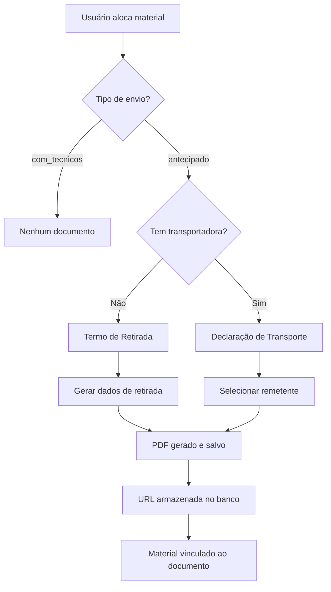
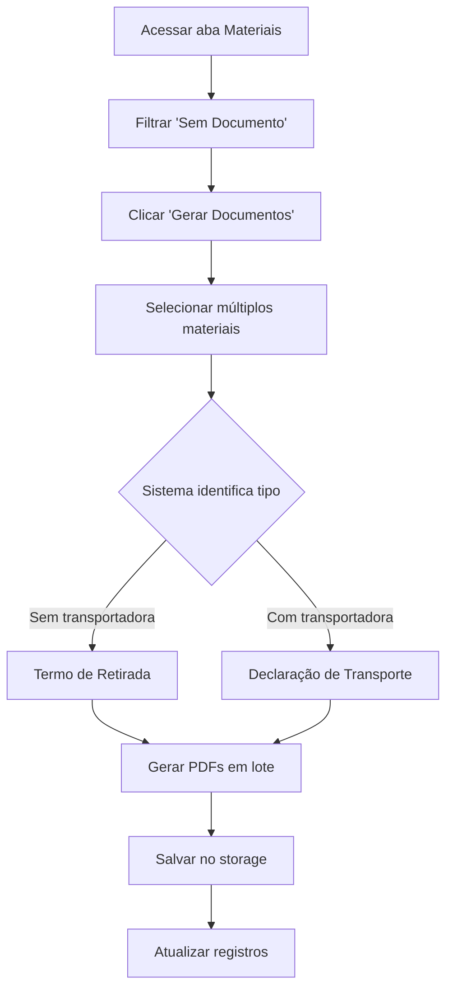
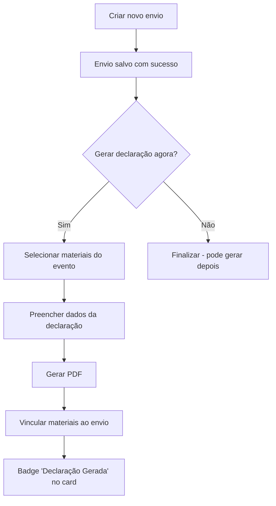

# 📦 Sistema de Documentos de Transporte

## 🎯 Visão Geral

Sistema completo para geração automática de **Termos de Retirada** e **Declarações de Transporte** para materiais alocados em eventos. O sistema garante rastreabilidade completa e documentação legal para movimentação de equipamentos.

## 📊 Fluxos de Geração

### Fluxo Automático (Durante Alocação)



### Fluxo Retroativo (Materiais Já Alocados)



### Fluxo de Integração com Transportadoras



## 🗂️ Estrutura de Dados

### Campos em `eventos_materiais_alocados`

| Campo | Tipo | Descrição | Quando é Preenchido |
|-------|------|-----------|---------------------|
| `termo_retirada_url` | TEXT | URL do PDF de retirada | Retirada por terceiros sem transportadora |
| `declaracao_transporte_url` | TEXT | URL do PDF de declaração | Envio com transportadora |
| `retirado_por_nome` | TEXT | Nome completo de quem retirou | Termo de Retirada |
| `retirado_por_documento` | TEXT | CPF/RG/CNPJ | Termo de Retirada |
| `retirado_por_telefone` | TEXT | Telefone de contato | Termo de Retirada |
| `data_retirada` | TIMESTAMP | Data/hora da retirada | Ao gerar qualquer documento |
| `valor_declarado` | NUMERIC | Valor do material para seguro | Declaração de Transporte |
| `remetente_tipo` | TEXT | 'empresa' ou 'membro' | Declaração de Transporte |
| `remetente_membro_id` | UUID | ID do membro remetente | Se remetente_tipo = 'membro' |
| `remetente_dados` | JSONB | Dados completos do remetente | Declaração de Transporte |
| `dados_destinatario` | JSONB | Dados do cliente destinatário | Declaração de Transporte |
| `dados_transportadora` | JSONB | Dados completos da transportadora | Declaração de Transporte |
| `envio_id` | UUID | ID do envio de transportadora | Ao vincular a um envio |

### Dados Salvos nos Campos JSONB

**`remetente_dados`:**
```json
{
  "nome": "Nome da Empresa / Membro",
  "documento": "CNPJ / CPF",
  "telefone": "(00) 00000-0000",
  "endereco": "Endereço completo"
}
```

**`dados_destinatario`:**
```json
{
  "nome": "Nome do Cliente",
  "documento": "CPF/CNPJ",
  "telefone": "(00) 00000-0000",
  "endereco": "Endereço do evento"
}
```

**`dados_transportadora`:**
```json
{
  "nome": "Nome da Transportadora",
  "cnpj": "00.000.000/0000-00",
  "telefone": "(00) 00000-0000",
  "responsavel": "Nome do responsável"
}
```

## 🔒 Segurança e Storage

### Bucket: `documentos-transporte`

- **Localização:** Supabase Storage
- **Política RLS:** Apenas usuários autenticados podem acessar
- **Visibilidade:** Privado (não público)
- **Retenção:** Permanente (não há deleção automática)

### Estrutura de Nomenclatura

```
termo-retirada-{eventoId}-{materialId}-{timestamp}.pdf
declaracao-transporte-{eventoId}-{materialId}-{timestamp}.pdf
```

## 🎨 Funcionalidades da Interface

### Aba "Materiais" do Evento

#### Filtros Disponíveis
- **Todos:** Mostra todos os materiais alocados
- **Sem Documento:** Materiais com `tipo_envio='antecipado'` sem documentos
- **Com Documento:** Materiais com `termo_retirada_url` ou `declaracao_transporte_url`
- **Equipe Técnica:** Materiais com `tipo_envio='com_tecnicos'`

#### Ações por Material
- **Download:** Baixa o documento existente (abre em nova aba)
- **Reimprimir:** Gera novo PDF substituindo o anterior (com confirmação)

#### Ações em Lote
- **Gerar Documentos:** Gera documentos para múltiplos materiais selecionados

### Aba "Transportadoras"

#### Card de Envio
- **Badge:** "Declaração Gerada" (verde) se houver declaração vinculada
- **Botão:** "Baixar Declaração" para download direto

## 📝 Cenários de Uso

### Cenário 1: Retirada por Funcionário da Empresa
1. Usuário aloca material com `tipo_envio='antecipado'`
2. Não informa transportadora
3. Sistema abre `RegistrarRetiradaDialog`
4. Usuário preenche dados de quem retira
5. **Resultado:** Termo de Retirada gerado automaticamente

### Cenário 2: Envio com Transportadora
1. Usuário aloca material com `tipo_envio='antecipado'`
2. Seleciona transportadora
3. Sistema abre `GerarDeclaracaoTransporteDialog`
4. Usuário seleciona remetente (empresa ou membro da equipe)
5. Preenche valores declarados
6. **Resultado:** Declaração de Transporte gerada

### Cenário 3: Materiais Já Alocados Sem Documento
1. Acessar aba "Materiais" do evento
2. Filtrar por "Sem Documento"
3. Clicar "Gerar Documentos"
4. Selecionar materiais desejados
5. Sistema identifica tipo automaticamente
6. **Resultado:** Documentos gerados em lote

### Cenário 4: Criar Envio e Gerar Declaração
1. Acessar aba "Transportadoras"
2. Criar novo envio
3. Sistema pergunta se quer gerar declaração
4. Se sim, selecionar materiais
5. Preencher dados da declaração
6. **Resultado:** Declaração vinculada ao envio

### Cenário 5: Reimprimir Documento
1. Acessar material na lista
2. Clicar "Reimprimir" ao lado do download
3. Confirmar ação
4. **Resultado:** Novo PDF gerado, URL atualizada

## 🔧 Tecnologias Utilizadas

- **jsPDF:** Geração de PDFs no cliente
- **Supabase Storage:** Armazenamento de arquivos
- **React Query:** Cache e sincronização de dados
- **TypeScript:** Tipagem forte dos dados

## ⚡ Otimizações Implementadas

### Cache de Configurações
- Configurações da empresa são cacheadas por 5 minutos
- Evita requisições repetidas ao banco

### Lazy Loading
- Geradores de PDF carregados sob demanda
- Reduz bundle inicial da aplicação

### Debounce em Buscas
- Delay de 300ms em campos de busca
- Evita queries desnecessárias

## ❓ FAQ

**P: Como gerar documento para material já alocado?**  
R: Na aba "Materiais", filtrar "Sem Documento", selecionar os materiais desejados e clicar "Gerar Documentos".

**P: Posso reimprimir um documento?**  
R: Sim, clique em "Reimprimir" ao lado do botão de download. O documento anterior será substituído.

**P: E se o material for perdido?**  
R: O documento permanece disponível no histórico do material, mesmo após devolução ou perda.

**P: Posso gerar declaração depois de criar o envio?**  
R: Sim, você pode gerar depois na aba "Materiais", selecionando os materiais e gerando a declaração retroativamente.

**P: Como vincular uma declaração a um envio existente?**  
R: Ao gerar a declaração retroativamente, você pode informar o `envio_id` manualmente ou criar um novo envio e vinculá-lo.

**P: O que acontece se eu excluir um envio que tem declaração?**  
R: O documento permanece vinculado aos materiais. Apenas o campo `envio_id` é mantido para histórico.

**P: Posso gerar múltiplas declarações para o mesmo material?**  
R: Sim, usando a função "Reimprimir" você pode gerar um novo documento que substitui o anterior.

## 📞 Suporte

Para dúvidas ou problemas com o sistema de documentos de transporte:
1. Verificar se todos os dados obrigatórios estão preenchidos
2. Confirmar que o material está alocado com `tipo_envio='antecipado'`
3. Verificar permissões de acesso ao storage
4. Consultar logs do navegador (F12) para erros específicos

---

**Última atualização:** 2025-10-30  
**Versão do sistema:** 1.0.0
